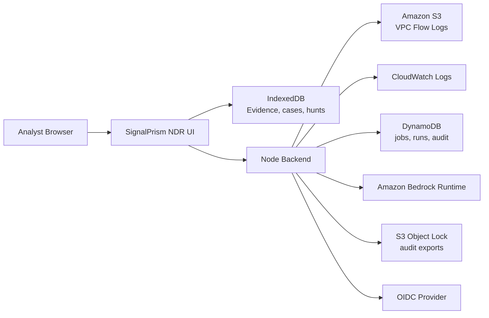
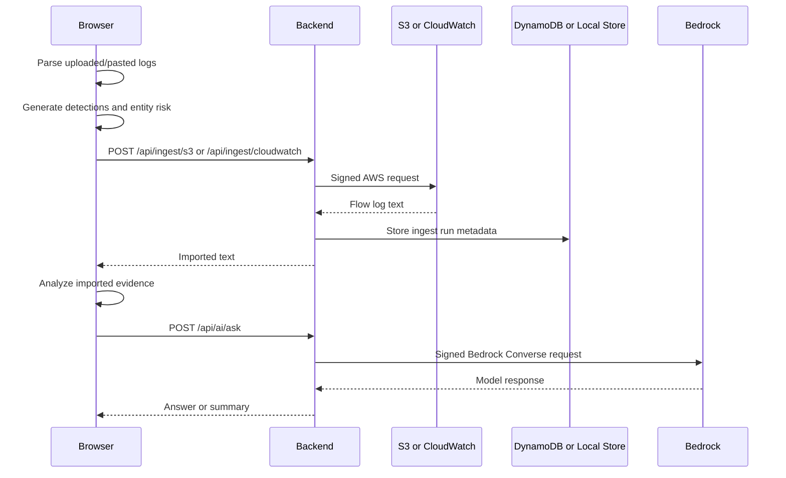

# Architecture

SignalPrism NDR is intentionally simple: a dependency-free browser application plus a small Node backend for protected cloud operations. The browser owns evidence parsing and investigation state. The backend owns AWS signing, authentication, scheduled ingest jobs, audit export, and optional Bedrock calls.

## System Context

## Frontend

Files:

- `index.html`: product shell, tabs, forms, dialogs, and panels.
- `styles.css`: responsive enterprise UI system.
- `app.js`: parser, analysis engine, state management, rendering, exports, case workflows, hunts, and AI context shaping.
- `src/idb-store.js`: IndexedDB persistence for evidence runs, cases, and case audit.
- `src/backend-client.js`: browser API client, API key storage, OIDC PKCE callback, cloud ingest, AI calls.
- `src/topology.js`: entity path graph building and SVG rendering.

The frontend can run without a backend for upload/paste analysis. Backend-only features display useful disabled states when unavailable.

## Backend

File:

- `server.mjs`

Responsibilities:

- Static file serving.
- Security headers.
- Rate limiting.
- API key and OIDC JWT authorization.
- S3 and CloudWatch ingest with AWS SigV4.
- Scheduled job management.
- Local JSON or DynamoDB persistence.
- Append-only audit records and export.
- Bedrock Converse API requests when feature-flagged.
- Health, readiness, and Prometheus-style metrics.

## AWS Signing

File:

- `src/aws-sigv4.mjs`

The backend signs AWS requests directly with SigV4. Local credentials use `AWS_ACCESS_KEY_ID`, `AWS_SECRET_ACCESS_KEY`, and optional `AWS_SESSION_TOKEN`. ECS/Fargate deployments can use task-role credentials through the container credential provider.

## Persistence

Browser persistence:

- IndexedDB stores evidence runs, case records, and case audit history.
- LocalStorage stores preferences, enrichment, hunts, baselines, API key, and OIDC token metadata.

Backend persistence:

- `NDR_STORE=local`: JSON/NDJSON files under `NDR_DATA_DIR`.
- `NDR_STORE=dynamodb`: single-table DynamoDB with `pk`, `sk`, `createdAt`, and serialized `payload`.

## Authentication And Authorization

Supported modes:

- Local development mode when no API key or OIDC issuer is configured.
- API key mode using `x-ndr-api-key`.
- OIDC mode with Authorization Code + PKCE in the browser and RS256 JWT verification in the backend.

Role mapping:

- `NDR_ADMIN_GROUP` -> `admin`
- `NDR_ANALYST_GROUP` -> `analyst`
- `NDR_VIEWER_GROUP` -> `viewer`

## Deployment Architecture

Terraform provisions:

- ECR.
- ECS Fargate service.
- ALB.
- EFS access point.
- DynamoDB.
- Secrets Manager.
- CloudWatch Logs.
- S3 Object Lock audit bucket.
- IAM roles and policies.
- ECS service autoscaling.

## Data Flow

## Design Principles

- Keep raw evidence local by default.
- Use the backend only for privileged operations.
- Prefer clear data models and replaceable storage boundaries.
- Keep AWS credentials out of the browser.
- Keep AI opt-in, bounded, and auditable.
- Avoid framework complexity until the app needs a build system.

## Known Architectural Limits

- `app.js` is intentionally large until a bundler/build step is introduced.
- Large evidence sets are bounded for browser performance.
- Bedrock answers are advisory and must be validated against source evidence.
- Terraform assumes an existing VPC and subnets.
