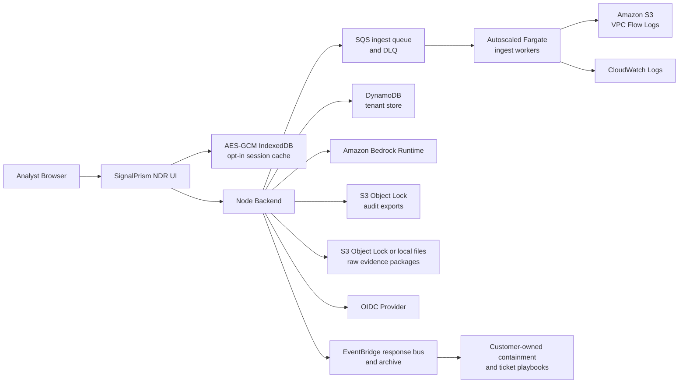
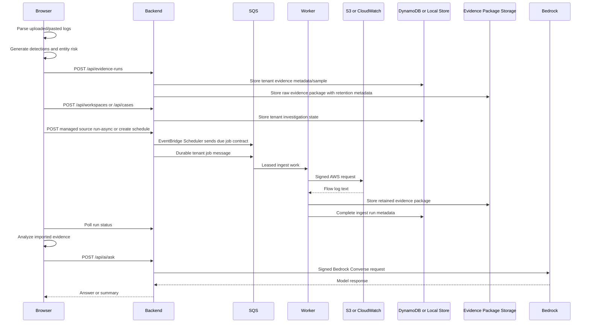

# Architecture

SignalPrism NDR is intentionally simple: a dependency-free browser application plus a small Node backend for protected cloud operations. The browser owns evidence parsing, detection execution, dashboards, and investigation workflows. The backend owns AWS signing, authentication, tenant-scoped persistence, scheduled ingest jobs, controlled exports, audit review/export, and optional Bedrock calls.

## System Context

```mermaid
flowchart LR
  Analyst["Analyst Browser"] --> UI["SignalPrism NDR UI"]
  UI --> IDB["AES-GCM IndexedDB<br>opt-in session cache"]
  UI --> API["Node Backend"]
  API --> Queue["SQS ingest queue<br>and DLQ"]
  Queue --> Worker["Autoscaled Fargate<br>ingest workers"]
  Worker --> S3["Amazon S3<br>VPC Flow Logs"]
  Worker --> CW["CloudWatch Logs"]
  API --> DDB["DynamoDB<br>tenant store"]
  API --> BR["Amazon Bedrock Runtime"]
  API --> Audit["S3 Object Lock<br>audit exports"]
  API --> Evidence["S3 Object Lock or local files<br>raw evidence packages"]
  API --> OIDC["OIDC Provider"]
  API --> Bus["EventBridge response bus<br>and archive"]
  Bus --> Automation["Customer-owned containment<br>and ticket playbooks"]
```

## Frontend

Files:

- `index.html`: product shell, tabs, forms, dialogs, and panels.
- `styles.css`: responsive enterprise UI system.
- `app.js`: compatibility orchestrator, VPC Flow Log workbench, shared state, core rendering, exports, and legacy pure helpers.
- `src/idb-store.js`: tenant-plus-subject scoped IndexedDB persistence for evidence runs, cases, and case audit.
- `src/backend-client.js`: browser API client, API key storage, OIDC PKCE callback, cloud ingest, AI calls.
- `src/topology.js`: entity path graph building and SVG rendering.
- `src/platform-ui.mjs` and `src/operations-ui.mjs`: enterprise platform, command-center, case-task, governance, and education-facing operations surfaces.
- `src/enterprise-telemetry.mjs`, `src/enterprise-analytics.mjs`, and `src/advanced-operations.mjs`: bounded normalization, correlation, behavior, campaigns, urgency, graph, protocol, threat-intelligence, packet, and agent logic.
- `src/ocsf.mjs` and `src/connector-catalog.mjs`: OCSF profiles/delivery records and governed connector policy.

The frontend can run without a backend for upload/paste analysis. Backend-only features display useful disabled states when unavailable.

## Backend

File:

- `server.mjs`

Responsibilities:

- Static file serving.
- Security headers.
- Rate limiting.
- API key and OIDC JWT authorization.
- S3 and CloudWatch ingest with AWS SigV4.
- Scheduled job management with validated intervals, per-tenant quotas, conditional replica leases, and conditional active-run slots.
- SQS-backed durable async imports with separate API and worker process roles, retry/DLQ behavior, and queue metrics.
- Durable OCSF stream outbox with per-record acknowledgements, leases, bounded retries, terminal dead-letter state, and operator replay.
- Bounded CloudTrail, Route 53 DNS, GuardDuty, Zeek, and Suricata normalization plus evidence-linked cross-source correlation.
- Two-person response requests that emit approved actions only to a configured EventBridge bus.
- Ed25519 detection-content verification with test-only import and separate production promotion.
- Tenant-scoped local JSON or DynamoDB persistence for workspaces, cases, evidence runs, managed sources, jobs, runs, enterprise artifacts, and audit records.
- Full raw evidence package persistence to local object-package files or S3 Object Lock storage.
- Tenant admin roster and source ownership management.
- Enterprise settings, detection-rule catalog, and advanced artifact persistence for copilot notes, threat-intel imports, playbook runs, evidence vault bundles, and reports.
- Two-person, expiring, one-time investigation/Security Lake export approvals with OCSF content-hash binding.
- Durable S3/CloudWatch job runs with browser polling status and worker-safe completion handling.
- Append-only audit records, filtered audit review, and NDJSON export.
- RBAC-controlled investigation package export.
- Bedrock Converse API requests when feature-flagged.
- Public health plus admin-protected readiness and Prometheus-style metrics.

## AWS Signing

File:

- `src/aws-sigv4.mjs`

The backend signs AWS requests directly with SigV4. Local credentials use `AWS_ACCESS_KEY_ID`, `AWS_SECRET_ACCESS_KEY`, and optional `AWS_SESSION_TOKEN`. ECS/Fargate deployments can use task-role credentials through the container credential provider.

## Persistence

Browser persistence:

- Local workspaces, sources, and cases are scoped by tenant plus principal and used as a development fallback when the backend is unavailable.
- IndexedDB raw-evidence caching is disabled by default. When explicitly enabled after authentication, evidence is AES-GCM sealed with a key bound to the tenant, principal, CSRF/session identity, and expiry; wrappers contain no plaintext evidence.
- LocalStorage stores scoped preferences, enrichment, hunts, and baselines. Legacy unscoped security data is purged during migration.
- SessionStorage stores OIDC PKCE verifier/state and backend-issued CSRF/session metadata for the active browser session.
- HttpOnly SameSite cookies hold only an opaque UUID and HMAC. Tenant session-registry records hold principal, CSRF, revocation, and TTL state.

Backend persistence:

- `NDR_STORE=local`: JSON/NDJSON files under `NDR_DATA_DIR`.
- `NDR_STORE=dynamodb`: single-table DynamoDB with `pk`, `sk`, serialized `payload`, `schemaVersion=2`, top-level revision/update fields, TTL, a global `kind-createdAt-index` for scheduler discovery, and `tenant-kind-createdAt-index` for bounded tenant listing. Dual-read migration merges legacy and indexed records until backfill is complete.
- All records use tenant-scoped partitions shaped as `TENANT#<tenantId>#<kind>`, including jobs, runs, audit, sessions, approvals, leases, and run slots.
- The Admin audit-review UI reads a bounded, filtered tenant event list and exports the tenant audit stream as NDJSON for external review.

Evidence package persistence:

- Browser uploads use direct signed S3 transfer when object storage is configured; large raw evidence is not embedded in metadata JSON.
- The metadata/sample is stored with the evidence run.
- The full raw package is written to `.ndr-data/evidence-packages/<tenant>/` in local mode.
- When `NDR_EVIDENCE_BUCKET` is configured, the backend writes package JSON to S3 with Object Lock mode and retain-until-date headers.
- Evidence package metadata stores the object URI, retention deadline, size, mode, and whether raw evidence was included.
- Production quarantine and vault objects are version/checksum bound. A trusted scanner signs the exact clean-object identity before the server performs and reverifies the immutable vault copy.

## Authentication And Authorization

Supported modes:

- Local development mode when no API key or OIDC issuer is configured.
- Browser session mode using opaque HMAC-protected HttpOnly IDs and CSRF headers after API-key or OIDC login.
- API key mode using `x-ndr-api-key` for API clients.
- OIDC bearer mode for API clients, with Authorization Code + PKCE used by the browser to create a backend session.
- Server-side session registry validation and CSRF for every cookie-authenticated mutation and audit export.
- Recent OIDC MFA step-up for packet access, controlled export approval, and response approval in production.

Role mapping:

- `NDR_ADMIN_GROUP` -> `admin`
- `NDR_ANALYST_GROUP` -> `analyst`
- `NDR_VIEWER_GROUP` -> `viewer`

Tenant mapping:

- `NDR_TENANT_CLAIM` selects the OIDC claim used as `tenantId` and is required by default.
- Fallback claims include `tenant_id`, `org_id`, `organization`, and `custom:tenant_id`.
- API key and local-dev sessions use `NDR_DEFAULT_TENANT`.

Authorization boundaries:

- `admin`: full tenant access, tenant roster/source ownership management, access review, audit review/export, destructive deletes.
- `analyst`: create/update tenant workspaces, cases, sources, evidence runs, enterprise artifacts, ingest jobs, AI actions, and investigation exports.
- `viewer`: read-only tenant inspection for workspaces, cases, sources, evidence runs, detection rules, enterprise settings, and enterprise artifacts. AI and exports are blocked.

Source access is explicit. Admins default to `all`; analysts and custom/service identities default to `assigned`, where an empty assignment denies source-derived data. `group` mode resolves only sources with an intersecting source group.

S3 and CloudWatch ingestion are tenant-source centric by default. Analyst-created sources are server-owned by that analyst, and client ownership fields cannot clear the boundary. Arbitrary ingest payloads are available only when `NDR_ALLOW_DIRECT_INGEST=true`.

## Deployment Architecture

Terraform provisions:

- ECR.
- Separate ECS Fargate API and autoscaled ingest-worker services.
- SQS ingest queue, dead-letter queue, queue-age alarms, and worker queue-depth autoscaling.
- EventBridge Scheduler schedules that enqueue fixed, tenant-bound managed-source jobs.
- EventBridge response bus and retained event archive.
- ALB with HTTPS enforcement, access logging, deletion protection, and header validation.
- AWS WAF managed rules and rate limiting.
- Encrypted EFS access point with backup policy.
- DynamoDB with PITR, TTL, and scheduler GSI.
- ECS secret injection from pre-existing Secrets Manager ARNs, keeping plaintext out of state.
- CloudWatch Logs, Container Insights, and alarms.
- S3 Object Lock audit bucket.
- S3 Object Lock evidence package bucket.
- Separate encrypted evidence quarantine bucket with short lifecycle, checksum-bound presigned uploads, and an external scanner-attestation handoff.
- IAM roles and policies.
- ECS service autoscaling plus non-root/read-only task hardening and narrowed network egress.

## Data Flow

```mermaid
sequenceDiagram
  participant B as Browser
  participant A as Backend
  participant Q as SQS
  participant W as Worker
  participant S as S3 or CloudWatch
  participant D as DynamoDB or Local Store
  participant E as Evidence Package Storage
  participant R as Bedrock

  B->>B: Parse uploaded/pasted logs
  B->>B: Generate detections and entity risk
  B->>A: POST /api/evidence-runs
  A->>D: Store tenant evidence metadata/sample
  A->>E: Store raw evidence package with retention metadata
  B->>A: POST /api/workspaces or /api/cases
  A->>D: Store tenant investigation state
  B->>A: POST managed source run-async or create schedule
  A->>Q: EventBridge Scheduler sends due job contract
  A->>Q: Durable tenant job message
  Q->>W: Leased ingest work
  W->>S: Signed AWS request
  S-->>W: Flow log text
  W->>E: Store retained evidence package
  W->>D: Complete ingest run metadata
  B->>A: Poll run status
  B->>B: Analyze imported evidence
  B->>A: POST /api/ai/ask
  A->>R: Signed Bedrock Converse request
  R-->>A: Model response
  A-->>B: Answer or summary
```

## Design Principles

- Keep raw evidence local by default.
- Store full raw evidence packages only when explicitly saved through the backend or ingested through managed cloud paths, with retention metadata.
- Use the backend only for privileged operations.
- Enforce tenant boundaries server-side for shared workspaces, cases, sources, evidence metadata, exports, and AI actions.
- Prefer clear data models and replaceable storage boundaries.
- Keep AWS credentials out of the browser.
- Keep AI opt-in, bounded, and auditable.
- Keep domain modules independently testable and preserve the no-runtime-dependency browser path.

## Known Architectural Limits

- `app.js` remains a compatibility orchestrator. New enterprise domains are split into modules; a future bundler can finish extracting the tightly coupled legacy flow workbench without changing public behavior.
- Large evidence sets are bounded for browser performance.
- Zeek and Suricata support consumes enriched event telemetry; SignalPrism does not capture or reconstruct full packets.
- EventBridge targets and containment implementation are environment-owned and must deduplicate by action ID.
- Bedrock answers are advisory and must be validated against source evidence.
- Terraform assumes an existing VPC and subnets.
- Large evidence packages use presigned browser-to-S3 uploads; local-only development still uses the bounded JSON package path.
- The quarantine/scan API is implemented, but the malware engine and sandbox are deployment-owned integrations.
- Multi-region deployment uses one isolated Terraform stack per regional cell; automatic cross-region replication and failover orchestration are not bundled.

## Enterprise Platform Extensions

The Platform workspace is isolated in `src/platform-ui.mjs`, while the detection-operations command center and advanced controls live in `src/operations-ui.mjs`. Both use service functions in `src/backend-client.js`. Core analytics remain deterministic in `src/enterprise-analytics.mjs`; seasonal models, source health, temporal entity resolution, Community ID, encrypted/protocol analytics, urgency, exposure paths, data economics, packet manifests, and agent evaluation live in `src/advanced-operations.mjs`. OCSF projection and Firehose records live in `src/ocsf.mjs`; connector endpoint and secret-reference policy lives in `src/connector-catalog.mjs`.

The AWS data plane uses Kinesis for replayable continuous normalized telemetry. Security Lake publication splits Network Activity and Security Finding into separate Data Firehose streams, extracts region/account/day partitions, converts projected fields to Zstandard Parquet, and catalogs the output in Glue. Native integrations target OCSF 1.8; Security Lake uses a separate OCSF 1.3 profile. Raw evidence and audit records remain separate Object Lock assets. Connector and response execution crosses an EventBridge intent boundary so the API never owns arbitrary webhook behavior or provider-specific response credentials.

SCIM uses a dedicated bearer-token boundary. Service-account tokens are tenant encoded, expire, are shown once, and persist only as HMAC digests. Organizations onboarding stores constrained member-role ARNs and external IDs on managed sources; ingest assumes those roles only for the selected S3 or CloudWatch source.
