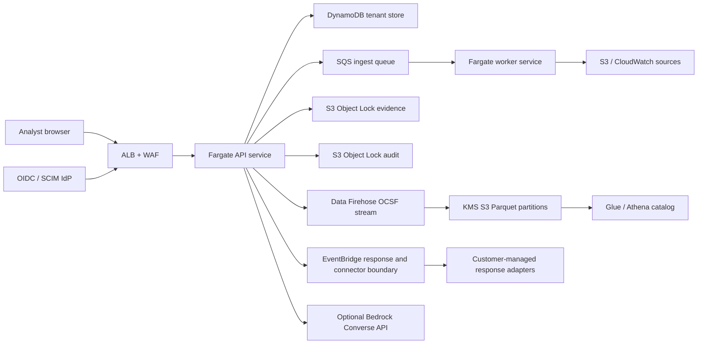

# SignalPrism Enterprise Platform

## Product Brief

### Target users

- Tier 1-3 SOC analysts investigating cloud and network incidents.
- Threat hunters running retrospective searches across normalized telemetry.
- Detection engineers validating analytics before promotion.
- Incident commanders coordinating campaigns, cases, and response actions.
- Tenant administrators managing identity, sources, connectors, and retention.
- Security architects operating multi-account AWS estates and Security Lake pipelines.

### Problem

Cloud evidence is fragmented across VPC Flow Logs, identity audit trails, DNS, workload sensors, network sensors, and third-party detections. SignalPrism turns those records into a tenant-isolated investigation graph with explainable detections, behavior deviations, campaigns, governed response, and immutable evidence.

### Primary workflows

1. Ingest logs through upload, managed S3/CloudWatch sources, scheduled jobs, or the streaming API.
2. Normalize telemetry into one bounded event model and publish OCSF records to Amazon Data Firehose.
3. Correlate source-native detections with behavioral deviations and assemble linked campaigns.
4. Hunt historical telemetry with a safe fielded query language.
5. Create a case, request a dry-run or enforced response, approve it independently, verify it, and roll it back when supported.
6. Produce an evidence-cited deterministic or Bedrock-assisted investigation.
7. Administer users, custom roles, SCIM lifecycle provisioning, service accounts, connectors, sources, and cross-account ownership.

### Main views

- **Overview / Detections / Entities / Records:** core evidence triage.
- **Hunt / Coverage / Pipeline:** search, telemetry coverage, and ingest operations.
- **Cases / Topology:** case lifecycle and time-based path replay.
- **Admin:** users, source ownership, export approvals, and audit review.
- **Enterprise:** correlation, response, signed detections, governance, and reporting.
- **Platform:** streaming, behavior, campaigns, retrospective hunts, AI investigations, connectors, Organizations onboarding, direct evidence uploads, posture, roles, and service accounts.
- **Reports:** analyst exports and optional Bedrock summaries.

### Acceptance criteria

This version is complete when tenant-scoped operators can exercise every workflow locally, AWS-backed features fail closed when unconfigured, deterministic analytics are testable without cloud credentials, mutations are audited, destructive or externally effective operations are governed, and the production path is represented in Terraform.

## Architecture



### Runtime modules

- `server.mjs`: authenticated HTTP control plane, tenant stores, ingest, approvals, audit, and AWS calls.
- `src/enterprise-telemetry.mjs`: bounded parser and multi-provider normalization.
- `src/enterprise-analytics.mjs`: behavior profiles, campaign graph, hunts, rule backtests, AI traffic posture, and crypto posture.
- `src/advanced-operations.mjs`: source health, seasonal models, temporal entity graph, Community ID, encrypted/protocol analytics, urgency, exposure, economics, intelligence matching, packet manifests, response policy, and agent evaluation.
- `src/operations-ui.mjs`: urgency-first detection operations and advanced platform controls.
- `src/ocsf.mjs`: isolated OCSF 1.8 native and OCSF 1.3 Security Lake mappings, validation, class-specific batches, Firehose records, and partitions.
- `src/connector-catalog.mjs`: connector schemas, endpoint policy, secret-reference policy, and adapter events.
- `src/platform-ui.mjs`: isolated Platform workspace controller.
- `src/aws-sigv4.mjs`: signed requests and presigned S3 upload URLs.

## Supported Telemetry

| Source | Format value | Important fields |
| --- | --- | --- |
| AWS CloudTrail | `cloudtrail` | principal, action, result, source address, account, region |
| Route 53 Resolver | `route53-dns` | query, response, source, resolver, transport |
| GuardDuty | `guardduty` | finding, resource, connection endpoints, severity |
| Zeek | `zeek` | connection, DNS, notice, bytes, service |
| Suricata EVE | `suricata` | alert, flow, DNS, application protocol |
| Azure NSG | `azure-nsg` | tuple, direction, decision, interface, bytes |
| Azure Activity | `azure-activity` | caller, operation, resource, result |
| Microsoft Entra | `entra-audit` | initiator, target, activity, result |
| GCP VPC Flow | `gcp-vpc-flow` | connection, instance, reporter, bytes |
| GCP Audit | `gcp-audit` | principal, method, resource, result |
| Kubernetes Audit | `kubernetes-audit` | user, verb, object, namespace, status |
| Cilium Hubble | `cilium-hubble` | pod, namespace, verdict, L4/L7 path |
| Gigamon / IPFIX / CEF | `gigamon` | exporter, endpoints, application, TLS metadata |
| ExtraHop RevealX | `extrahop` | detection, participants, risk score, protocol |
| Pre-normalized JSON | `generic` | canonical SignalPrism fields |

JSON, JSON arrays, JSONL, and CEF lines are accepted. API batches are capped at 1,000 records; the parser itself is capped at 5,000 records per call. Larger continuous workloads should use batching and the streaming endpoint.

## Analytics

### Behavior analytics

Profiles are tenant-scoped and explain every deviation with evidence IDs and contributing attributes. Current detectors cover:

- New peer relationships against a stored baseline.
- New destination services against a stored baseline.
- Off-hours activity concentration.
- Byte-volume deviation using a three-standard-deviation threshold and floor.
- Low-jitter periodic connections.
- Repeated denied or failed activity.

Profiles start in `learning` state and change to `compared` when a previous profile exists. Production operators should define a baseline promotion process so incident traffic does not silently become approved behavior.

### Campaigns

Campaign assembly links correlations and behavioral findings when they share an entity or evidence ID inside a configured window. It reports stages, evidence, source formats, confidence, score, and blast radius by entity, account, and region. The graph is deterministic and can be rebuilt after detection-content changes.

### Retrospective hunt

The hunt parser does not use `eval`, SQL, or regular expressions supplied by users. Supported operators are `:`, `=`, `!=`, `>`, `>=`, `<`, and `<=`; Boolean operators are `AND`, `OR`, and `NOT`. Parentheses and `*` wildcards are supported. Fields are allowlisted.

Example:

```text
sourceIp:10.0.* AND (outcome:failure OR severity:high) NOT destinationPort:443
```

### Detection backtesting

Backtests are immutable server records bound to the rule version/digest, dataset, engine, quality gate, and timestamp. They report scanned and matched records, evidence IDs, noise rate, and optional precision/recall when malicious and benign labels are supplied. Production promotion requires an exact, passing, non-stale backtest, ATT&CK mapping, substantive description, and an independent admin; client-supplied counters are ignored.

### AI and cryptography governance

- AI traffic posture recognizes common model providers from normalized domain and SNI metadata and distinguishes sanctioned providers.
- Cryptography posture identifies deprecated TLS versions, weak ciphers, expiring certificates, and observed post-quantum KEM metadata.
- No TLS interception or key custody is performed by SignalPrism. Decryption remains a customer sensor or packet-broker responsibility.

## Identity and Authorization

### Human identities

OIDC tokens require issuer, audience, subject, expiry, issued-at time, RS256 verification, and a tenant claim in hardened deployments. Tenant directory records can disable access or override mapped roles.

### Roles

Built-in roles are `admin`, `analyst`, and `viewer`. Custom roles choose a conservative base role and add allowlisted permissions and optional identity attributes. Existing API authorization remains based on the base role, preserving fail-closed behavior while permission-aware endpoints are introduced incrementally.

### Service accounts

Service-account tokens:

- Are tenant encoded and scoped to a base role and optional managed-source IDs.
- Use 256-bit random secrets.
- Store only an HMAC-SHA256 digest under `NDR_SERVICE_ACCOUNT_PEPPER`.
- Expire within 365 days and default to 90 days.
- Are displayed only at creation or rotation.
- Can be revoked immediately and are audited.

### SCIM

`/scim/v2` implements service-provider discovery, schemas, resource types, role groups, user list/filter/create/read/replace/patch/deactivate. It uses a dedicated bearer token and configured tenant, not an interactive session cookie. Use a distinct high-entropy token stored in Secrets Manager.

## Evidence and Data Lake

### Direct evidence upload

1. The browser hashes the file with SHA-256.
2. The API creates a tenant path and a short-lived SigV4 `PUT` URL.
3. Content type, checksum, tenant metadata, upload ID, Object Lock mode, and retention date are signed headers.
4. The browser uploads directly to S3.
5. The API verifies size and available S3 checksum metadata with `HEAD` before marking the upload complete.

Production CORS must list exact HTTPS origins through `direct_upload_allowed_origins`. Do not use wildcard origins.

### OCSF pipeline

Normalized events map to OCSF Network Activity (`class_uid=4001`). Correlations, behavior findings, and campaigns map to Security Finding (`class_uid=2001`). Records are validated before delivery.

Terraform provisions:

- A Data Firehose stream accepting `PutRecordBatch`.
- Dynamic `region/accountId/eventDay` partitions.
- OpenX JSON deserialization and Zstandard Parquet serialization.
- A Glue external table for the projected OCSF fields.
- A KMS-encrypted, private, versioned S3 analytics bucket with tiering and expiration.

This creates class-specific Security Lake OCSF 1.3 Parquet zones. The compatibility controller persists the Security Lake-assigned prefix and provider identity and produces two registration-ready source records, one for Network Activity and one for Security Finding. Applying those registrations remains a delegated-administrator deployment action because ownership, regions, and subscriber principals differ by organization.

## Connectors and Response

Connector records support Gigamon, Corelight, ExtraHop, Splunk, Elastic, Sentinel, Security Hub, ServiceNow, Jira, CrowdStrike, Defender, TAXII, MISP, Kafka, syslog, and Security Lake. SignalPrism stores only AWS Secrets Manager ARNs. It rejects plaintext endpoints, embedded credentials, and private or loopback URLs.

Connector tests emit a typed EventBridge request when the adapter bus is enabled; otherwise they perform validation-only tests. SignalPrism does not fetch user-entered URLs from the API process, avoiding an SSRF boundary.

Response actions support dry-run and enforce modes, expiration, rollback plans, independent approval, verification evidence, and rollback requests. Supported intents include entity isolation, IP block, access-key disablement, security-group restriction, workload quarantine, session revocation, time-bounded packet capture, ticket creation, and SOC notification. The control plane emits intent to EventBridge; customer-managed adapters own credentials and provider-specific execution.

## Important Edge Cases

- A missing AWS feature configuration returns `503` or a validation-only result; it never silently claims execution.
- Cross-tenant IDs resolve as not found because every storage key includes the tenant partition.
- A requester cannot approve their own export, rule promotion, or response action.
- Direct evidence sessions expire, cannot complete twice, and reject size or checksum mismatches.
- Connector secrets cannot be submitted as raw values.
- Service accounts cannot access managed sources outside their optional source scope.
- SCIM deactivation revokes matching sessions.
- Bedrock evidence is treated as attacker-controlled input and model output is never treated as an executed action.
- Firehose partial failures are counted and returned; required publications fail if any record is rejected.
- Local mode is a development fallback, not a horizontally scalable production store.

## Known Boundaries

- This repository provisions the central AWS control plane, not member-account roles. Deploy `infra/aws/member-account-role.yaml` through StackSets.
- EventBridge response and connector adapters are intentionally separate deployables with separate credentials and blast radius.
- The included Glue schema projects stable OCSF fields. Extend it under schema governance before relying on additional nested fields in Athena.
- Packet capture requests are governed EventBridge intents. Capture storage, packet filtering, consent boundaries, and TLS decryption require an external sensor such as Gigamon, Corelight, ExtraHop, Suricata, Zeek, or a cloud traffic-mirroring appliance.
- Behavior baselines are deterministic profiles; there is no external ML training service in this version.

## Operational Rollout

1. Deploy development with OIDC, DynamoDB, queues, Object Lock buckets, Firehose, and test adapters.
2. Deploy member-account read roles with a unique external ID.
3. Verify S3 and CloudWatch source ownership before scheduling imports.
4. Configure exact evidence-upload CORS origins.
5. Register the OCSF Parquet zone as a Security Lake custom source where required.
6. Run rule backtests and promote detections through independent approval.
7. Run every response adapter in dry-run mode and validate rollback before enabling enforcement.
8. Connect SCIM and complete joiner, mover, leaver tests.
9. Run restore, queue failure, Firehose partial failure, and regional failover exercises.
10. Enable production hardening only after all readiness checks pass.
